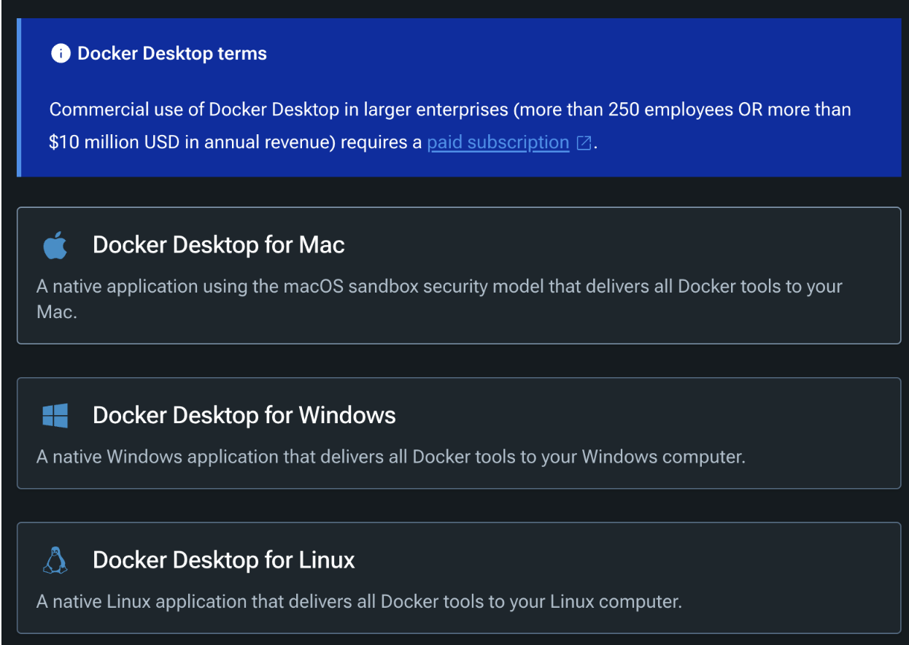
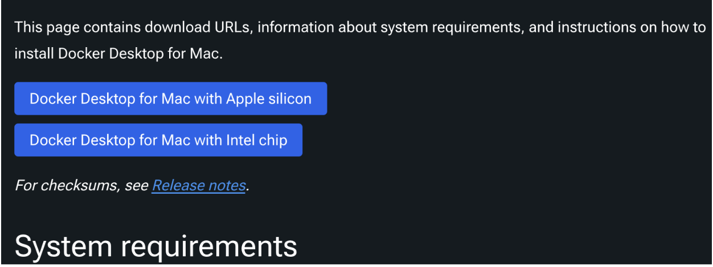
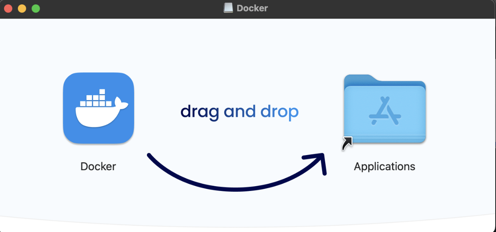
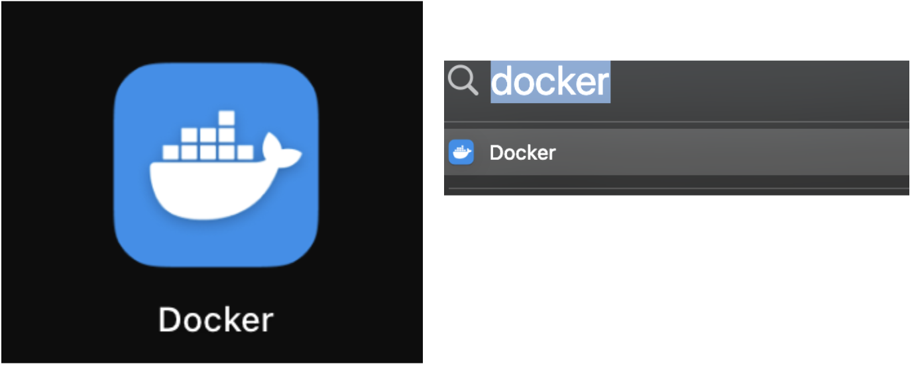
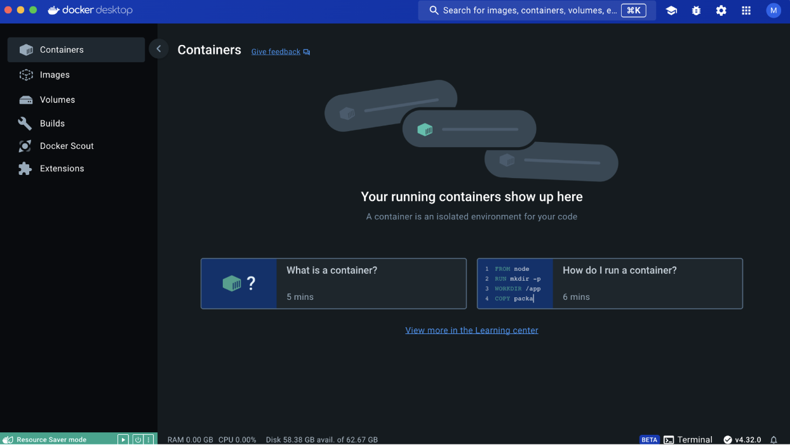
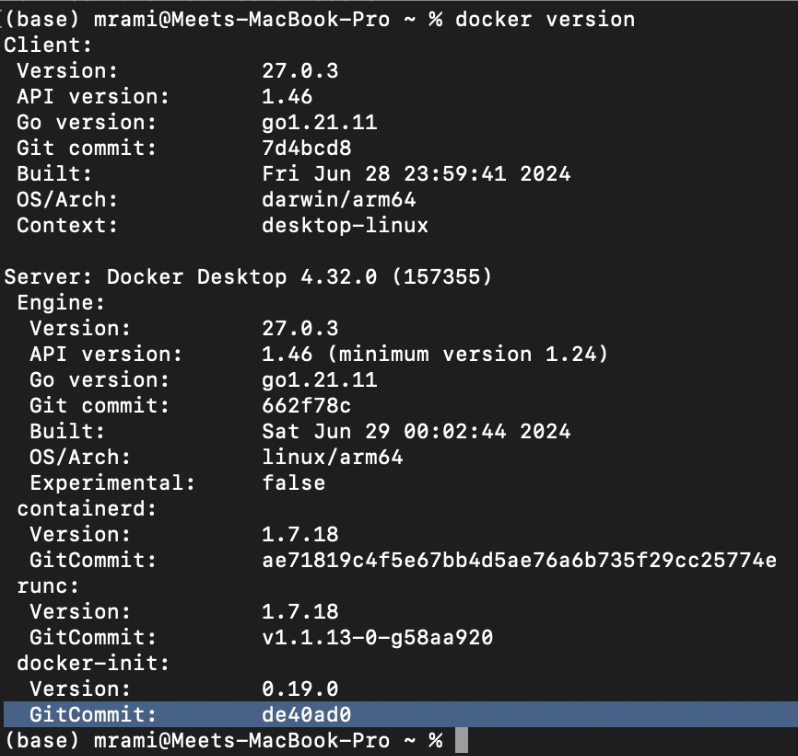

# CS670-Project

Steps followed to install docker

1: Go to https://docs.docker.com/get-docker/ select the OS you want to install docker for

2: For example, I use Mac, so I clicked on “Docker Desktop for Mac” which lands you in following page

3: Ensure system requirements are satisfied to avoid any conflict later down the road. Also, based on your Mac (M1 or Intel chip) docker download file will be different. Once clicked on applied button .dmg file will be downloaded:

4: Open the file and drag Docker to Application 

5: Once installed you will see Docker on your Launchpad, or you can do command + space and type docker

6: After following instructions you will have docker desktop open on your device:

7: You may also open terminal and check docker client and server both are running by typing “docker version” 

